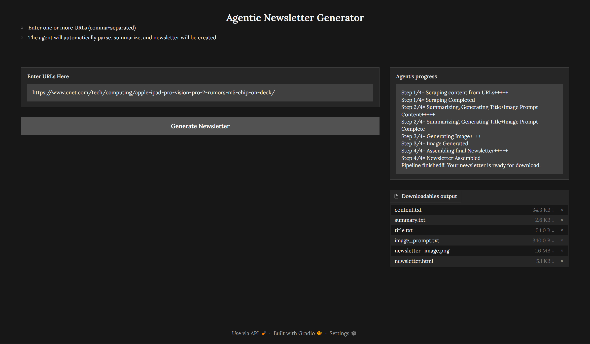

# Agent for Newsletter Creation
This repository contains a NLP project focused on an AI agent for automating the process of newsletter creation. 
The project leverages the LangChain, HuggingFace, Torch frameworks etc to create the bot. 

## Technologies
Modules used:
1. Transformers (For summarization models)
2. Bitsandbytes (For quantization)
3. Diffusers (For image creation)
4. Gradio User Interface
5. ~~Langchain (for Document Loaders, Text Splitters, Chain creation)~~ // REMOVED CHAIN Because of Using Powerful and large context length Qwen Models

## ~~Future~~ Now Present ~~ideas~~:
Use of Gradio interface for seamless interaction, better diffusion and summarization models for quality output, and better html templates.
- Qwen 2 7b Instruct Model (Because of kaggle resource limitations, I tried to use Qwen 3 too but transformer library's latest version is required it seems :) )
- Stable Diffusion XL Base 1.0 Model for Image Generation


The project utilizes the ~~"microsoft/Phi-3-mini-128k-instruct"~~ **Qwen 2 7b Instruct** model for summarizing, title generation and image prompt generation.
You can access it by adding input directly in kaggle or locally downloading or simply by using below code:
```
model_id = "Qwen/Qwen2-7B-Instruct"
```
and
the "stabilityai/stable-diffusion-xl-base-1.0" model for image creating.
You can access it directly by using below code:
```
pipe = DiffusionPipeline.from_pretrained(
  "stabilityai/stable-diffusion-xl-base-1.0",
  torch_dtype = torch.float16,
  variant = "fp16",
  use_safetensors = True
)
```

## Project Overview
The core of the project is to automate the process of newsletter creation with multiple URLs of similar topic.
The python file is included in this repository provides a detailed walkthrough of the model implementation.

## Procedure to building the model
### Data processing
Get the urls/website links as input, scrape the web content using WebBaseLoader, save the contents in content.txt
```
from langchain_community.document_loaders import WebBaseLoader

loader = WebBaseLoader("https://www.example.com/")
docs = loader.load()
```
Code Credits = Thank you [https://python.langchain.com/docs/integrations/document_loaders/web_base/](https://python.langchain.com/docs/integrations/document_loaders/web_base/)

### Summarizing and title creation
Use the content.txt and the summarization model by transformers library to create summary and save the text to summary.txt, use the same model and the summary for creating a catchy title

### Image creation
Use the summarization model to create a image_prompt and use that and title as input for diffusion model, save the image to newsletter_image.png

### Assembling
To bring together all the collected data and assemble in the html_template and output the path for html_template

## Note: 
User can input multiple URLs by simply separating each by comma

## OUTPUT Newsletter


